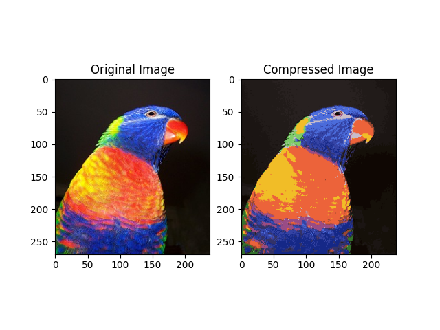

# k-means-image-compression
Image compression with k-means clustering.

## k-means Clustering
The k-means clustering algorithm is a popular technique for partitioning data. In such use cases, each observation in a data set is mapped to the kth cluster of a set of K clusters having the closet centroid to that observation. 

k-means clustering is iterative: after initializing K centroids – one for each of a set of K clusters – each observation of a dataset is assigned to a corresponding centroid, and the K centroids are recomputed.  This assignment and centroid computation are repeated for a desired number of iterations.  

In addition to data partitioning, k-means is applicable to feature learning, non-random sampling, and vector quantization. 

## Objective
In this repository, k-means clustering is used to compress images by reducing color content. Each pixel of an image is mapped – in terms of its color values – to a corresponding color centroid of a set of K color centroids.  This process is repeated for a desired number of iterations until every pixel’s color values are mapped to those of a corresponding color centroid. 

By default, K = 16. For typical RGB color images, compression reduces color content from millions of colors to 16 colors.  

## Script
`script.py` expects an input image in the same folder named `image.jpg`. 

The number of colors to compress the input image to can be set with the parameter `K`, and the number of iterations to perform k-means compression can be set with the parameter `ITERS`. By default, `K=16` and `ITERS=10`.

`script.py` first calls `initialize_centroids` to randomly initialize `K` centroids. These initial centroids are then passed to `apply_k_means`, which iteratively applies k-means to obtain optimized centroids. 

`apply_k_means` calls two functions:

-	`get_centroid_indices`, which iterates over every pixel in the input image and finds the closest color centroid to that pixel, and
-	`get_centroid_values`, which computes color pixel values for each centroid

The compressed output image is saved as `image_compressed.jpg` in the same folder as `script.py`.

## Example
A before/after example where the input image is reduced to 16 colors:

## Environment
`script.py` can be compiled with:
- Python 3.9.7
- Pillow 9.0.0
- Numpy 1.19.5
- Matplotlib 3.5.1
- Imageio 2.19.3

